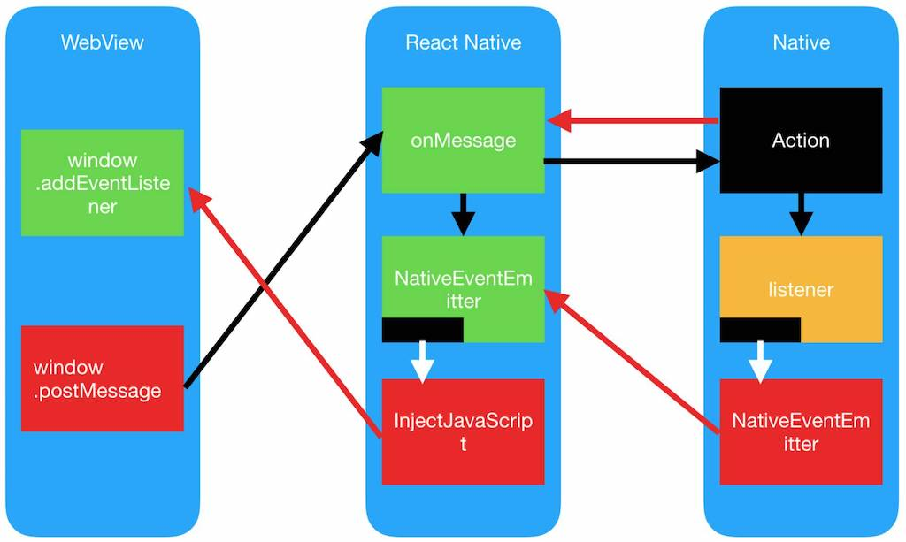

# Dore

> Dore is a WebView container implemented using React Native. Help you migrate Cordova application to React Native WebView.

**Dore 是一个使用 React Native 实现的 WebView 容器，可以让你在 WebView 调用 React Native 组件。**

设计初衷：用于迁移 Cordova 的 WebView 应用到 React Native 的 WebView。

Ionic v1 + Angular Demo: [examples](https://github.com/phodal/dore/tree/master/examples)

Screenshots:


Workflow:



微信群：


Features
---

### Support:
 
 - AppAvailability ([react-native-check-app-install](https://github.com/redpandatronicsuk/react-native-check-app-install))
 - AppState
 - AsyncStorage
 - BackHandler (Android)
 - Badge (by [react-native-icon-badge](https://github.com/uuau99999/react-native-icon-badge)
 - Brightness （by [react-native-device-brightness](https://github.com/Calvin-Huang/react-native-device-brightness))
 - Console
 - Clipboard 
 - DatePicker (iOS by [react-native-notag-datepicker](https://github.com/phodal/react-native-notag-datepicker))
 - DeviceInfo (by [react-native-device-info](https://github.com/rebeccahughes/react-native-device-info))
 - Geolocation
 - Keyboard
 - NetInfo
 - Orientation
 - Permissions (by [react-native-permissions](https://github.com/yonahforst/react-native-permissions))
 - ScreenShot (by [react-native-view-shot](https://github.com/gre/react-native-view-shot))
 - Shake (by [react-native-shake-event](https://github.com/jadsonlourenco/react-native-shake-event))
 - StatusBar
 - Toast (by [dore-toast](https://github.com/GrowthStudio/dore-toast))
 - Vibration
 
### Todo 

 - Battery (https://github.com/oojr/react-native-battery)
 - BLE 
 - Calender (https://github.com/wmcmahan/react-native-calendar-events)
 - Flashlight (https://github.com/ludo/react-native-torch)
 - fs 
 - Push Notifications (https://github.com/zo0r/react-native-push-notification)
 - SMS (https://github.com/tkporter/react-native-sms)
 - Storage
 - SQLite (https://github.com/andpor/react-native-sqlite-storage)
 - TTS (https://github.com/naoufal/react-native-speech)
 - more+

### UI

 - Camera
 - QRCode

Example
---

see in [examples](./examples)

1.Import to your React-Native WebView

```javascript
...
import Toast from 'dore-toast';
import Orientation from 'react-native-orientation';
import RNIconBadge from 'dore-icon-badge'
import RNDeviceInfo from "react-native-device-info";

import Dore from 'dore';

export default class ExampleWebView extends Component {
  ...
  
  constructor() {
    super()
    ...
    Dore.inject([{
      name: 'Toast',
      class: Toast
    }, {
      name: 'Orientation',
      class: Orientation
    }, {
      name: 'Badge',
      class: RNIconBadge
    }, {
      name: 'DeviceInfo',
      class: RNDeviceInfo
    }])
  }

  onMessage = evt => {
    Dore.handleMessage(evt, this.webView)
  };

  onWebViewLoadStart = () => {
    if (this.state.isLoading) {
      this.webView.injectJavaScript('window.isPhone = true;');
    }
  };

  render() {
    ...

    return (
      <View>
        <WebView
          ...
          onMessage={this.onMessage}
        />
      </View>
    )
  }
}
```

2.import [DoreClient](./client/DoreClient.js), e.x:

```html
<script src="js/promise.js"></script>
<script src="js/DoreClient.js"></script>
```

3.use in WebView

```javascript
DoreClient.showToast('Hello, world!')
```

APIs
---

### AppAvailability


| function         | return type   |    return             |
-------------------|---------------|-----------------------|
| isAppInstalled   |  promise      |    string             |
| isAppInstalledAndroid  |  promise      |    string             |
| checkURLScheme  |  promise      |    string             |

install:

```
yarn add react-native-check-app-install
react-native link
```

inject:

```javascript
import { AppInstalledChecker } from "react-native-check-app-install";

Dore.inject([{
  name: 'AppInstalledChecker',
  class: AppInstalledChecker
}]);
```

examples:

```javascript
DoreClient.checkURLScheme('whatsapp').then(function(response){
  $scope.isAppInstalled = response;
})
```

### App State

state value: ``active``, ``background``, ``inactive``

```javascript
DoreClient.addStateListener();
$ionicPlatform.on('STATE', function(event) {
  DoreClient.showToast(event.detail.data);
});
```

### AsyncSTORAGE

| function         | return type   |    return             |
-------------------|---------------|-----------------------|
| setAsyncStorage  |        -      |        -              |
| getAsyncStorage  |  promise      |    string             |

```javascript
$scope.setAsyncStorage = function (key, data) {
  DoreClient.setAsyncStorage(key, data);
};

$scope.getAsyncStorage = function (key) {
  DoreClient.getAsyncStorage(key).then(function(response){
    $scope.storage = response.data;
  })
};
```

### Back（ Android Only)

example:

```javascript
$ionicPlatform.on('ANDROID_BACK', function (event) {
  DoreClient.showToast('ANDROID_BACK');
});
```

### Badge

| function         | return type   |    return             |
-------------------|---------------|-----------------------|
| setBadge         |        -      |        -              |
| getBadge         |  promise      | { badge: 'xx' }       |
| clearBadge       |   -           |         -             |

```javascript
$scope.getBadge = function () {
  DoreClient.getBadge().then(function (data) {
    $scope.badge = data.badge;
    $scope.$apply();
  })
};
$scope.setBadge = function() {
  DoreClient.setBadge(19);
};
$scope.clearBadge = function() {
  DoreClient.clearBadge();
};
```

### Brightness

| function             | return type   |    return             |
-----------------------|---------------|-----------------------|
| getBrightnessLevel   |  promise      |      float            |
| setBrightnessLevel   |       -       |      -                |

```javascript
$scope.getBrightness = function () {
  DoreClient.getBrightnessLevel().then(function(brightness) {
    $scope.brightness = brightness;
    $scope.$apply();
  })
};
$scope.setBrightness = function () {
  DoreClient.setBrightnessLevel(0.2);
};
```

### Clipboard

| function             | return type   |    return             |
-----------------------|---------------|-----------------------|
| copy                 |       -       |                       |
| paste                |      event    |  window.event         |

copy:

```javascript
DoreClient.copy($scope.text);
```

paste:

```javascript
$ionicPlatform.on('PASTE', function(event) {
  $scope.copyText = event.detail.data;
  $scope.$apply();
});
DoreClient.paste();
```

### Console ([MDN Console](https://developer.mozilla.org/en-US/docs/Web/API/Console))

> send WebView console to React Native

```javascript
$scope.console = console; //  can use inline console function after register
$scope.outputSingleObject = function () {
  var someObject = {str: "Some text", id: 5};
  console.log(someObject);
};
$scope.outputMultipleObjects = function () {
  var car = "Dodge Charger";
  var someObject = {str: "Some text", id: 5};
  var optionalParams = [car, ". The object is:", someObject];
  console.info("My first car was a", optionalParams);
};
$scope.stringSubstitutions = function () {
  for (var i = 0; i < 5; i++) {
    var optionalParams = [ "Bob", i + 1];
    console.log("Hello, %s. You've called me %d times.", optionalParams);
  }
};
$scope.stylingConsoleOutput = function () {
  var optionalParams = ["color: yellow; font-style: italic; background-color: blue;padding: 2px"];
  console.log("This is %cMy stylish message", optionalParams);
};
$scope.groupInTheConsole = function () {
  console.log("This is the outer level");
  console.group();
  console.log("Level 2");
  console.group();
  console.log("Level 3");
  console.warn("More of level 3");
  console.groupEnd();
  console.log("Back to level 2");
  console.groupEnd();
  console.debug("Back to the outer level");
};
$scope.timers = function () {
  console.time("answer time");
  alert("Click to continue");
  console.timeEnd("answer time");
};
$scope.stackTraces = function () {
  function foo() {
    function bar() {
      console.trace();
    }

    bar();
  }

  foo();
};
```
### DatePicker


| function             | return type   |    return             |
-----------------------|---------------|-----------------------|
| showDatePicker       |    promise    |    { date: 'xx' }     |


```javascript
var options = {
  date: '2017-10-22 12:12:12',
  maxDate: '2022-10-22 12:12:12'
};
DoreClient.showDatePicker(options).then(function(data) {
  $scope.date = data.date;
  $scope.$apply();
});
```

### DeviceInfo

| function         | return type   |    return             |
-------------------|---------------|-----------------------|
| getAppVersion    |  promise      | { version: 'xx' }     |
| getUniqueID      |  promise      | { uniqueID: 'xx' }    |
| getBrand         |  promise      | { brand: 'xx' }       |
| getModel         |  promise      | { model: 'xx' }       |
| getSystemName    |  promise      | { systemName: 'xx' }  |
| isEmulator       |  promise      | boolean               |
| isTablet         |  promise      | boolean               |
 
examples: 
 
```javascript
$scope.getAppVersion = function() {
  DoreClient.getAppVersion().then(function(data) {
    $scope.version = data.version;
    $scope.$apply();
  });
};
$scope.isTablet = function() {
  DoreClient.isTablet().then(function(data) {
    $scope.isTablet = data;
    $scope.$apply();
  });
};
```

### Geolocation


| function             | return type   |    return             |
-----------------------|---------------|-----------------------|
| getCurrentPosition   |    promise    |         json          |
| watchPosition        |    event      |         event         |
| clearWatch           |       -       |           -           |
| stopObserving        |       -       |           -           |

```javascript
$scope.getCurrentPosition = function() {
  DoreClient.getCurrentPosition().then(function(data) {
    $scope.location = data;
    $scope.$apply();
  });
};

$scope.watchPosition = function() {
  $ionicPlatform.on('WATCH_POSITION', function(event) {
    $scope.wPosition = event.detail.data;
    $scope.$apply();
  });
  DoreClient.watchPosition();
};

$scope.clearWatch = function() {
  DoreClient.clearWatch();
};
$scope.stopObserving = function() {
  DoreClient.stopObserving();
};
```

### Keyboard

| function             | return type   |    return             |
-----------------------|---------------|-----------------------|
| hideKeyboard         |     -         |     -                 |

```javascript
DoreClient.hideKeyboard();
````

### NetInfo

| function                    | return type   |    return             |
------------------------------|---------------|-----------------------|
| getConnectionInfo           |    promise    |     json              |
| addNetInfoEventListener     |     event     |     event             |
| removeNetInfoEventListener  |     -         |     -                 |

```javascript
$scope.getConnectionInfo = function() {
  DoreClient.getConnectionInfo().then(function(data) {
    $scope.connectionInfo = data;
    $scope.$apply();
  });
};
$scope.addEventListener = function() {
  $ionicPlatform.on('CONNECTION_CHANGE', function(event) {
    $scope.wConnectionInfo = event.detail.data;
    $scope.$apply();
  });
  DoreClient.addNetInfoEventListener();
};
$scope.removeEventListener = function() {
  DoreClient.removeNetInfoEventListener();
};
```

### Orientation

| function             | return type   |    return             |
-----------------------|---------------|-----------------------|
| getOrientation       |     promise   |    string             |
| lockToLandscape      |        -      |     -                 |
| lockToPortrait       |        -      |     -                 |

```javascript
$scope.lockToLandscape = function() {
  DoreClient.lockToLandscape();
};
$scope.lockToPortrait = function() {
  DoreClient.lockToPortrait();
};
$scope.getConnectionInfo = function() {
  DoreClient.getConnectionInfo().then(function(data) {
    $scope.connectionInfo = data;
    $scope.$apply();
  });
};
```

### Permissions

| function             | return type   |    return             |
-----------------------|---------------|-----------------------|
| checkPermissions     |     promise   |      JSON             |
| requestPermissions   |     promise   |      JSON             |
| checkMultiple        |     promise   |      JSON             |

```javascript
$scope.checkPermissions = function () {
  DoreClient.checkPermissions('camera').then(function(response) {
    DoreClient.showToast(JSON.stringify(response));
  })
};
$scope.requestPermissions = function () {
  DoreClient.requestPermissions('camera').then(function(response) {
    DoreClient.showToast(JSON.stringify(response));
  })
};
$scope.checkMultiple = function () {
  DoreClient.checkMultiple(['camera', 'photo']).then(function(response) {
    DoreClient.showToast(JSON.stringify(response));
  })
};
```

### Screenshot

| function             | return type   |    return             |
-----------------------|---------------|-----------------------|
| captureScreen        |     string    |     URI               |


install: 

```
yarn add react-native-view-shot
react-native link react-native-view-shot
```

inject:

```javascript
import { captureScreen } from "react-native-view-shot";

Dore.inject([{
  name: 'Capture',
  class: captureScreen
}]);
```

Usage

```javascript
DoreClient.captureScreen().then(function(response) {
  
})
```

### StatusBar

| function             | return type   |    return             |
-----------------------|---------------|-----------------------|
| hideStatusBar        |     -         |       -               |
| showStatusBar        |     -         |       -               |

```javascript
DoreClient.hideStatusBar();
DoreClient.showStatusBar();
```

### Shake

| function             | return type   |    return             |
-----------------------|---------------|-----------------------|
| addShakeListener     |     event     |       -               |
| removeShakeListener  |     -         |       -               |

```javascript
$ionicPlatform.on('SHAKE', function (response) {
  $scope.shake = response.detail.data;
  $scope.$apply();
});
DoreClient.addShakeListener();
```

Done:

```javascript
DoreClient.removeShakeListener();
```


### Toast

| function             | return type   |    return             |
-----------------------|---------------|-----------------------|
| show                 |     -         |       -               |

``DoreClient.showToast(String,  duration: short | long ,  position: 'center' | 'top')``

```javascript
DoreClient.showToast('this is a toast');

DoreClient.showToast('this is a toast', 'long', 'center');
```

### Vibration


| function             | return type   |    return             |
-----------------------|---------------|-----------------------|
| vibrate              |     -         |       -               |
| show                 |     -         |       -               |

```javascript
DoreClient.vibrationVibrate(1000);

DoreClient.vibrationCancel();
```

Development
---
 
### DoreClient：**Browser -> vibrationVibrate -> DoreClient -> window.postMessage -> RN**

DoreClient, handle message in WebView

Browser

```javascript
$scope.vibrationVibrate = function () {
  DoreClient.vibrationVibrate([1000, 2000, 3000]);
};
```  

DoreClient

```javascript
function invoke(action, payload) {
  function postMessage(action, payload) {
    var message = JSON.stringify({
      action: action,
      payload: payload
    });
    window.postMessage(message, '');
  }
}

DoreClient = {
  vibrationVibrate: function (duration) {
    return invoke('VIBRATION', {type: 'VIBRATE', duration: duration});
  }
}
```

### Dore: WebView -> onMessage -> Dore -> xxxBridge -> Native

Dore, handle message in React Native

WebView

```javascript
onMessage = evt => {
  Dore.handleMessage(evt, this.webView)
};
```

Dore

```javascript
Dore.handleMessage = (event, webView) => {
  const action = eventData.action;
  switch (action) {
    case 'VIBRATION': {
      return VibrationBridge(payload)
    }
  }
}
```

Bridge


```javascript
import { Vibration } from 'react-native';

let VibrationBridge = (payload) => {
  if (payload.type === 'VIBRATE') {
    if (!payload.options) {
      return Vibration.vibrate(500)  // is duration is fixed time (about 500ms)
    }

    if (Number.isInteger(payload.duration) || payload.duration.length > 0) {
      return Vibration.vibrate(payload.duration)
    }
  } else if (payload.type === 'CANCEL') {
    Vibration.cancel();
  }
};
```

License
---

[](http://ideas.phodal.com/)

© 2017 A [Phodal Huang](https://www.phodal.com)'s [Idea](http://github.com/phodal/ideas).  This code is distributed under the MIT license. See `LICENSE` in this directory.
